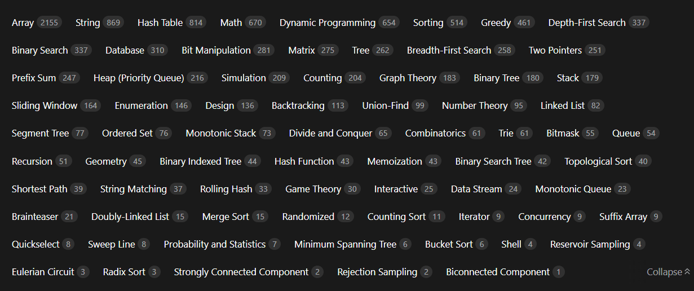

<div align="center">

# DSA-in-Cpp

### Documenting my journey of mastering Data Structures & Algorithms in C++

*Detailed notes • Clean implementations • Patterns • LeetCode problem-solving, topic by topic*

[](https://en.cppreference.com/)
[](https://leetcode.com/)
[](https://github.com/Purvijain1234/DSA-in-Cpp/pulls)

</div>

---

## 📖 About This Repository

This repository is a **structured, topic-wise collection** of my Data Structures & Algorithms learning journey in **C++**. It's built to be genuinely useful for **interview preparation, revision, and daily practice** — not just a code dump.

Every folder represents a core DSA topic. Inside, I'm steadily adding **LeetCode problems solved with clean, commented C++ code**, along with the reasoning, patterns, and intuition behind each approach — the kind of thinking you actually need to reproduce under interview pressure.

<div align="center">


<i>Topic-wise problem distribution across LeetCode - the map this repo is being built against</i>
</div>

<br>

---

## 📂 Repository Structure

```
DSA-in-Cpp/
│
├── 📁 Array/                    # Array manipulation, searching & sorting patterns
├── 📁 Dynamic Programming/      # Memoization, tabulation & DP patterns
├── 📁 Graph/                    # BFS, DFS, shortest path & graph algorithms
├── 📁 LinkedList/               # Singly, doubly & circular linked list operations
├── 📁 Math/                     # Number theory & mathematical problem solving
├── 📁 Patterns/                 # Pattern printing & logic building
├── 📁 Queue/                    # Queue implementations & variations
├── 📁 Stack/                    # Stack implementations & monotonic stack problems
├── 📁 String/                   # String manipulation & pattern matching
├── 📁 Trees/                    # Binary trees, BST, traversals & tree algorithms
│
├── 📁 assets/                   # Images used in this README
└── 📄 README.md
```

Each topic folder is being populated with individual **LeetCode problem solutions in C++**, named after the problem, so revision is quick and searchable.

---

## 🗂️ Topics Covered

> Click on any topic below to expand — includes what the topic actually is, the core concepts to know, and the most important interview questions to master 👇

<details>
<summary><b>📊 Array</b></summary>
<br>

**What it is:** A linear collection of elements stored in contiguous memory, giving O(1) random access by index. It's usually the first topic tested in any interview because almost every other data structure is built on top of it.

**Core concepts to know:** two-pointer technique, sliding window, prefix sums, in-place manipulation, sorting-based tricks, and time/space trade-offs between brute-force O(n²) and optimized O(n) or O(n log n) approaches.

**Important interview questions:**
- Two Sum / Three Sum / Four Sum
- Kadane's Algorithm (Maximum Subarray)
- Best Time to Buy and Sell Stock
- Move Zeroes / Rotate Array
- Merge Intervals
- Product of Array Except Self
- Find the Duplicate / Missing Number
- Trapping Rain Water
- Next Permutation

🔗 [Explore Array Folder →](https://github.com/Purvijain1234/DSA-in-Cpp/tree/main/Array) · [Practice Array problems on LeetCode ↗](https://leetcode.com/tag/array/)

</details>

<details>
<summary><b>🔗 LinkedList</b></summary>
<br>

**What it is:** A linear data structure where elements (nodes) are connected via pointers instead of contiguous memory. Unlike arrays, insertion/deletion is O(1) once you have the position, but random access is O(n).

**Core concepts to know:** fast & slow pointer technique, in-place reversal, cycle detection (Floyd's algorithm), dummy node tricks, and merging/splitting logic for singly, doubly, and circular lists.

**Important interview questions:**
- Reverse a Linked List (iterative & recursive)
- Detect and Remove a Cycle
- Merge Two Sorted Lists
- Find the Middle of a Linked List
- Remove Nth Node From End
- Add Two Numbers (as linked lists)
- Flatten a Multilevel Linked List
- LRU Cache (linked list + hash map)

🔗 [Explore LinkedList Folder →](https://github.com/Purvijain1234/DSA-in-Cpp/tree/main/LinkedList) · [Practice LinkedList problems on LeetCode ↗](https://leetcode.com/tag/linked-list/)

</details>

<details>
<summary><b>📚 Stack</b></summary>
<br>

**What it is:** A LIFO (Last In, First Out) structure. It's the go-to tool whenever a problem involves "matching," "nearest previous/next element," or undoing the most recent operation.

**Core concepts to know:** monotonic stacks (increasing/decreasing), expression parsing (infix/postfix/prefix), using a stack to simulate recursion, and when to reach for a stack versus a queue.

**Important interview questions:**
- Valid Parentheses
- Next Greater Element / Next Smaller Element
- Largest Rectangle in Histogram
- Min Stack (O(1) getMin)
- Stock Span Problem
- Evaluate Reverse Polish Notation
- Daily Temperatures
- Trapping Rain Water (stack approach)

🔗 [Explore Stack Folder →](https://github.com/Purvijain1234/DSA-in-Cpp/tree/main/Stack) · [Practice Stack problems on LeetCode ↗](https://leetcode.com/tag/stack/)

</details>

<details>
<summary><b>🎫 Queue</b></summary>
<br>

**What it is:** A FIFO (First In, First Out) structure, essential for anything involving order-preserving processing — task scheduling, level-order traversal, and buffering.

**Core concepts to know:** circular queues, deques (double-ended queues), priority queues (heaps), and using a queue to implement BFS.

**Important interview questions:**
- Implement Queue using Stacks (and vice versa)
- Sliding Window Maximum (deque)
- Design Circular Queue
- First Non-Repeating Character in a Stream
- Task Scheduler
- Rotten Oranges (multi-source BFS)

🔗 [Explore Queue Folder →](https://github.com/Purvijain1234/DSA-in-Cpp/tree/main/Queue) · [Practice Queue problems on LeetCode ↗](https://leetcode.com/tag/queue/)

</details>

<details>
<summary><b>🔤 String</b></summary>
<br>

**What it is:** Strings are essentially arrays of characters, but they come with their own family of problems around pattern matching, encoding, and immutability quirks in C++ (`std::string` vs `char*`).

**Core concepts to know:** hashing, sliding window on strings, two-pointer palindrome checks, KMP / Z-function for pattern matching, and frequency-count based anagram logic.

**Important interview questions:**
- Longest Substring Without Repeating Characters
- Valid Anagram / Group Anagrams
- Longest Palindromic Substring
- String to Integer (atoi)
- Minimum Window Substring
- Implement strStr() (KMP)
- Longest Common Prefix
- Valid Palindrome

🔗 [Explore String Folder →](https://github.com/Purvijain1234/DSA-in-Cpp/tree/main/String) · [Practice String problems on LeetCode ↗](https://leetcode.com/tag/string/)

</details>

<details>
<summary><b>🌳 Trees</b></summary>
<br>

**What it is:** A hierarchical, non-linear data structure. Binary Trees and Binary Search Trees (BSTs) show up constantly in interviews because they test recursion, traversal logic, and balancing intuition all at once.

**Core concepts to know:** inorder/preorder/postorder/level-order traversals, recursive vs iterative approaches, BST insertion/deletion/search properties, height & diameter calculations, and Lowest Common Ancestor (LCA) logic.

**Important interview questions:**
- Level Order Traversal (BFS on trees)
- Maximum Depth / Diameter of Binary Tree
- Validate Binary Search Tree
- Lowest Common Ancestor
- Construct Binary Tree from Preorder & Inorder
- Serialize and Deserialize a Binary Tree
- Balanced Binary Tree Check
- Kth Smallest Element in a BST

🔗 [Explore Trees Folder →](https://github.com/Purvijain1234/DSA-in-Cpp/tree/main/Trees) · [Practice Tree problems on LeetCode ↗](https://leetcode.com/tag/tree/)

</details>

<details>
<summary><b>🕸️ Graph</b></summary>
<br>

**What it is:** A collection of nodes (vertices) connected by edges, used to model networks, dependencies, and relationships. Graphs are considered one of the harder interview topics because there are so many representations and algorithms to choose from.

**Core concepts to know:** adjacency list vs matrix representation, BFS & DFS traversal, shortest path (Dijkstra, Bellman-Ford), topological sort, cycle detection, and union-find (disjoint set) for connectivity problems.

**Important interview questions:**
- Number of Islands (BFS/DFS on grid)
- Course Schedule (Topological Sort)
- Clone Graph
- Dijkstra's Shortest Path
- Detect Cycle in Directed/Undirected Graph
- Union-Find: Number of Provinces
- Word Ladder (BFS)
- Minimum Spanning Tree (Prim's/Kruskal's)

🔗 [Explore Graph Folder →](https://github.com/Purvijain1234/DSA-in-Cpp/tree/main/Graph) · [Practice Graph problems on LeetCode ↗](https://leetcode.com/tag/graph/)

</details>

<details>
<summary><b>🧮 Dynamic Programming</b></summary>
<br>

**What it is:** An optimization technique for problems with overlapping subproblems and optimal substructure — instead of recomputing the same subproblem repeatedly, you store the result. It's consistently ranked as the most feared and most tested interview topic.

**Core concepts to know:** memoization (top-down) vs tabulation (bottom-up), identifying state and transition, 1D vs 2D DP, and recognizing classic patterns like Knapsack, LIS, and LCS.

**Important interview questions:**
- 0/1 Knapsack
- Longest Common Subsequence (LCS)
- Longest Increasing Subsequence (LIS)
- Coin Change
- Edit Distance
- House Robber
- Partition Equal Subset Sum
- Climbing Stairs / Fibonacci-style DP
- Matrix Chain Multiplication

🔗 [Explore Dynamic Programming Folder →](https://github.com/Purvijain1234/DSA-in-Cpp/tree/main/Dynamic%20Programming) · [Practice DP problems on LeetCode ↗](https://leetcode.com/tag/dynamic-programming/)

</details>

<details>
<summary><b>➗ Math</b></summary>
<br>

**What it is:** Number-theory and math-based logic that frequently shows up as a building block inside bigger problems — interviewers use it to test whether you can reason about edge cases and efficiency beyond brute force.

**Core concepts to know:** primality testing (Sieve of Eratosthenes), GCD/LCM (Euclidean algorithm), modular arithmetic, fast exponentiation, and bit manipulation tricks.

**Important interview questions:**
- Sieve of Eratosthenes
- GCD and LCM
- Power(x, n) — Fast Exponentiation
- Count Set Bits / Single Number (XOR)
- Check Power of Two/Three
- Pow Mod / Modular Exponentiation
- Excel Sheet Column Number
- Happy Number

🔗 [Explore Math Folder →](https://github.com/Purvijain1234/DSA-in-Cpp/tree/main/Math) · [Practice Math problems on LeetCode ↗](https://leetcode.com/tag/math/)

</details>

<details>
<summary><b>🔺 Patterns</b></summary>
<br>

**What it is:** Pattern-printing problems using nested loops. These aren't typically asked in FAANG-level interviews, but they build the loop-control intuition and logical thinking that every DSA journey starts with — and they're common in campus placement rounds.

**Core concepts to know:** nested loop control, row-column relationships, and translating a visual shape into loop bounds.

**Important interview questions:**
- Pyramid / Inverted Pyramid Patterns
- Diamond Pattern
- Pascal's Triangle
- Floyd's Triangle
- Number/Star Patterns with conditional logic

🔗 [Explore Patterns Folder →](https://github.com/Purvijain1234/DSA-in-Cpp/tree/main/Patterns)

</details>

---

## 🚀 Getting Started

Want to run or explore the code locally? Clone the repo and jump into any topic folder:

```bash
# Clone the repository
git clone https://github.com/Purvijain1234/DSA-in-Cpp.git

# Move into the project directory
cd DSA-in-Cpp

# Pick a topic folder and compile any solution
g++ Array/<filename>.cpp -o solution
./solution
```

<details>
<summary>💻 Recommended tools</summary>
<br>

- **Compiler:** GCC / G++ (C++17 or later recommended)
- **IDE:** VS Code with the C/C++ extension, or any IDE of your choice
- **Online alternative:** [CompilerExplorer](https://godbolt.org/) or [OneCompiler](https://onecompiler.com/cpp) if you don't want a local setup

</details>

---

## 🤝 Contributing

Contributions, suggestions, and improvements are always welcome!

<details>
<summary><b>How to contribute</b></summary>
<br>

1. **Fork** this repository
2. **Create** your feature branch
   ```bash
   git checkout -b feature/your-topic-addition
   ```
3. **Commit** your changes
   ```bash
   git commit -m "Add: <problem/topic name>"
   ```
4. **Push** to your branch
   ```bash
   git push origin feature/your-topic-addition
   ```
5. **Open a Pull Request** 🎉

</details>

If you find this repository helpful, consider giving it a ⭐ — it keeps the motivation going!

---

## 📬 Connect with Me

<div align="center">

[](https://github.com/Purvijain1234)

</div>

---

<div align="center">

### ⭐ If this repository helped you in your DSA journey, don't forget to star it!

*Consistency beats intensity - one problem at a time.* 🚀

</div>
